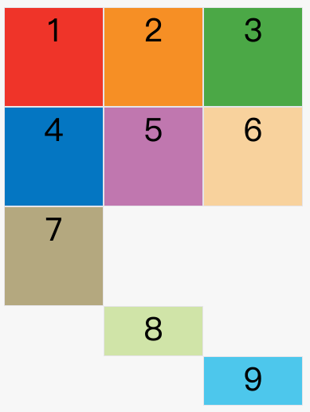

1. grid网格布局
   1. Grid 布局与 Flex 布局有一定的相似性，都可以指定容器内部多个项目的位置
      1. Flex 布局是轴线布局，只能指定"项目"针对轴线的位置，可以看作是一维布局
      2. Grid 布局则是将容器划分成"行"和"列"，产生单元格，然后指定"项目所在"的单元格，可以看作是二维布局。Grid 布局远比 Flex 布局强大
      3. Grid 布局的属性分成两类。一类定义在容器上面，称为容器属性；另一类定义在项目上面，称为项目属性。
   2. 基本概念
      1. 容器和项目
         1. 采用网格布局的区域，称为"容器"（container）
         2. 容器内部采用网格定位的子元素，称为"项目"（item）
         3. 注意：项目只能是容器的顶层子元素，不包含项目的子元素
      2. 单元格
         1. 行和列的交叉区域，称为"单元格"（cell）
      3. 网格线
         1. 划分网格的线，称为"网格线"（grid line）。水平网格线划分出行，垂直网格线划分出列。
         2. 正常情况下，n行有n + 1根水平网格线，m列有m + 1根垂直网格线，比如三行就有四根水平网格线
   3. 容器属性
      1. display 属性
         1. display: grid 指定一个容器采用网格布局。
         2. display: inline-grid 容器元素都是块级元素，但也可以设成行内元素
         3. 设为网格布局以后，容器子元素（项目）的float、display: inline-block、display: table-cell、vertical-align和column-*等设置都将失效
      2. grid-template-columns 、 grid-template-rows 属性
         1. grid-template-columns属性定义每一列的列宽
         2. grid-template-rows属性定义每一行的行高
            ```
            .container {
              display: grid;
              grid-template-columns: 100px 100px 100px;
              grid-template-rows: 100px 100px 100px;

              grid-template-rows: repeat(3, 33.33%);
              grid-template-columns: repeat(auto-fill, 100px);  // 表示每列宽度100px，然后自动填充，直到容器不能放置更多的列。
              grid-template-columns: 1fr 1fr;
              grid-template-columns: 1fr 1fr minmax(100px, 1fr);
              grid-template-columns: [c1] 100px [c2] 100px [c3] auto [c4]
            }
            ```
            1. repeat()函数，简化重复的值
               1. 接受两个参数，第一个参数是重复的次数（上例是3），第二个参数是所要重复的值
            2. auto-fill 关键字
               1. 有时，单元格的大小是固定的，但是容器的大小不确定
               2. 如果希望每一行（或每一列）容纳尽可能多的单元格，这时可以使用auto-fill关键字表示自动填充
            3. fr 关键字
               1. 为了方便表示比例关系，网格布局提供了fr关键字（fraction 的缩写，意为"片段"）。如果两列的宽度分别为1fr和2fr，就表示后者是前者的两倍
            4. minmax()
               1. 产生一个长度范围，表示长度就在这个范围之中。它接受两个参数，分别为最小值和最大值
            5. auto 关键字
               1. auto关键字表示由浏览器自己决定长度
            6. 网格线的名称
               1. grid-template-columns属性和grid-template-rows属性里面，还可以使用方括号，指定每一根网格线的名字，方便以后的引用
               2. 网格布局允许同一根线有多个名字，比如[fifth-line row-5]
            7. 布局实例
               1. grid-template-columns属性对于网页布局非常有用。两栏式布局只需要一行代码
               2. grid-template-columns: 70% 30%;
      3. grid-row-gap、grid-column-gap、grid-gap  属性
         1. grid-row-gap属性设置行与行的间隔（行间距），grid-column-gap属性设置列与列的间隔（列间距）
         2. grid-gap属性是grid-column-gap和grid-row-gap的合并简写形式，语法如下。
            1. `grid-gap: <grid-row-gap> <grid-column-gap>`
            2. 如果grid-gap省略了第二个值，浏览器认为第二个值等于第一个值
         3. 根据最新标准，上面三个属性名的grid-前缀已经删除，grid-column-gap和grid-row-gap写成column-gap和row-gap，grid-gap写成gap
      4. grid-template-areas 属性
         1. 网格布局允许指定"区域"（area），一个区域由单个或多个单元格组成。grid-template-areas属性用于定义区域
            ```
            grid-template-areas: 'a b c'
                                 'd e f'
                                 'g h i';
            多个单元格合并成一个区域的写法如下
            grid-template-areas: 'a a a'
                                 'b b b'
                                 'c c c';
            布局实例
            grid-template-areas: "header header header"
                                 "main main sidebar"
                                 "footer footer footer";
            如果某些区域不需要利用，则使用"点"（.）表示
            grid-template-areas: 'a . c'
                                 'd . f'
                                 'g . i';
            ```
            1. 注意，区域的命名会影响到网格线。每个区域的起始网格线，会自动命名为区域名-start，终止网格线自动命名为区域名-end
            2. 比如，区域名为header，则起始位置的水平网格线和垂直网格线叫做header-start，终止位置的水平网格线和垂直网格线叫做header-end
      5. grid-auto-flow 属性
         1. 划分网格以后，容器的子元素会按照顺序，自动放置在每一个网格。默认的放置顺序是"先行后列"，即先填满第一行，再开始放入第二行
            1. 这个顺序由grid-auto-flow属性决定，默认值是row，即"先行后列"。也可以将它设成column，变成"先列后行
            2. grid-auto-flow: column;
         2. grid-auto-flow属性除了设置成row和column，还可以设成row dense和column dense
            1. 这两个值主要用于，某些项目指定位置以后，剩下的项目怎么自动放置
            2. 下面的例子让1号项目和2号项目各占据两个单元格，然后在默认的grid-auto-flow: row情况下，会产生下面这样的布局
               1.  
               2. 1号项目后面的位置是空的，这是因为3号项目默认跟着2号项目，所以会排在2号项目后面。
            3. 现在修改设置，设为row dense，表示"先行后列"，并且尽可能紧密填满，尽量不出现空格
               1.  
               2. 上图会先填满第一行，再填满第二行，所以3号项目就会紧跟在1号项目的后面。8号项目和9号项目就会排到第四行
      6. justify-items、align-items、place-items 属性
         1. justify-items属性设置单元格内容的水平位置（左中右），align-items属性设置单元格内容的垂直位置（上中下）
            ```
            justify-items: start | end | center | stretch;
            align-items: start | end | center | stretch;
            ```
         2. 这两个属性的写法完全相同，都可以取下面这些值
            1. start：对齐单元格的起始边缘。
            2. end：对齐单元格的结束边缘。
            3. center：单元格内部居中。
            4. stretch：拉伸，占满单元格的整个宽度（默认值）
         3. place-items属性是align-items属性和justify-items属性的合并简写形式。
            1. `place-items: <align-items> <justify-items>;`
            2. 如果省略第二个值，则浏览器认为与第一个值相等
      7. justify-content、align-content、place-content  属性
         1. justify-content属性是整个内容区域在容器里面的水平位置（左中右），align-content属性是整个内容区域的垂直位置（上中下）
            ```
            justify-content: start | end | center | stretch | space-around | space-between | space-evenly;
            align-content: start | end | center | stretch | space-around | space-between | space-evenly;  
            ```
            1. start - 对齐容器的起始边框
            2. end - 对齐容器的结束边框
            3. center - 容器内部居中
            4. stretch - 项目大小没有指定时，拉伸占据整个网格容器
            5. space-around - 每个项目两侧的间隔相等。所以，项目之间的间隔比项目与容器边框的间隔大一倍
            6. space-between - 项目与项目的间隔相等，项目与容器边框之间没有间隔
            7. space-evenly - 项目与项目的间隔相等，项目与容器边框之间也是同样长度的间隔
         2. place-content属性是align-content属性和justify-content属性的合并简写形式
            1. `place-content: <align-content> <justify-content>`
            2. 如果省略第二个值，浏览器就会假定第二个值等于第一个值
      8. grid-auto-columns、grid-auto-rows 属性
         1. 有时候，一些项目的指定位置，在现有网格的外部。比如网格只有3列，但是某一个项目指定在第5行。这时，浏览器会自动生成多余的网格，以便放置项目
         2. grid-auto-columns属性和grid-auto-rows属性用来设置，浏览器自动创建的多余网格的列宽和行高。
            ```
            划分好的网格是3行 x 3列，但是，8号项目指定在第4行，9号项目指定在第5行。
            grid-template-columns: 100px 100px 100px;
            grid-template-rows: 100px 100px 100px;
            grid-auto-rows: 50px;
            上面代码指定新增的行高统一为50px（原始的行高为100px）
            ```
            1. 
      9. grid-template、grid  属性
         1. grid-template属性是grid-template-columns、grid-template-rows和grid-template-areas这三个属性的合并简写形式
         2. grid属性是grid-template-rows、grid-template-columns、grid-template-areas、 grid-auto-rows、grid-auto-columns、grid-auto-flow这六个属性的合并简写形式。
   4. 项目属性
      1. grid-column-start、grid-column-end、grid-row-start、grid-row-end 属性
         1. 项目的位置是可以指定的，具体方法就是指定项目的四个边框，分别定位在哪根网格线
            1. grid-column-start：左边框所在的垂直网格线
            2. grid-column-end：右边框所在的垂直网格线
            3. grid-row-start：上边框所在的水平网格线
            4. grid-row-end：下边框所在的水平网格线
            5. 这四个属性的值，除了指定为第几个网格线，还可以指定为网格线的名字
            6. 这四个属性的值还可以使用span关键字，表示"跨越"，即左右边框（上下边框）之间跨越多少个网格
               1. `grid-column-start: span 2;`
               2. 这与下面的代码效果完全一样
               3. `grid-column-end: span 2;`
         2. 其他项目都没有指定位置，由浏览器自动布局，这时它们的位置由容器的grid-auto-flow属性决定，这个属性的默认值是row，因此会"先行后列"进行排列。
         3. 使用这四个属性，如果产生了项目的重叠，则使用z-index属性指定项目的重叠顺序
      2. grid-column、grid-row 属性
         1. grid-column属性是grid-column-start和grid-column-end的合并简写形式
         2. grid-row属性是grid-row-start属性和grid-row-end的合并简写形式。
            ```
            grid-column: <start-line> / <end-line>;
            grid-row: <start-line> / <end-line>;
            ```
         3. 这两个属性之中，也可以使用span关键字，表示跨越多少个网格
            ```
            grid-column: 1 / span 2;
            grid-row: 1 / span 2;
            ```
      3. grid-area 属性
         1. grid-area属性指定项目放在哪一个区域
            1. `grid-area: e;`
         2. grid-area属性还可用作grid-row-start、grid-column-start、grid-row-end、grid-column-end的合并简写形式，直接指定项目的位置
            1. `grid-area: <row-start> / <column-start> / <row-end> / <column-end>;`
      4. justify-self、align-self、place-self  属性
         1. justify-self属性设置单元格内容的水平位置（左中右），跟justify-items属性的用法完全一致，但只作用于单个项目
         2. align-self属性设置单元格内容的垂直位置（上中下），跟align-items属性的用法完全一致，也是只作用于单个项目
         3. 这两个属性都可以取下面四个值
            1. start：对齐单元格的起始边缘。
            2. end：对齐单元格的结束边缘。
            3. center：单元格内部居中。
            4. stretch：拉伸，占满单元格的整个宽度（默认值）。
         4. place-self属性是align-self属性和justify-self属性的合并简写形式
            1. `place-self: <align-self> <justify-self>;`
            2. 如果省略第二个值，place-self属性会认为这两个值相等
2. vue在样式中使用data中的变量
   ```
    <template>
      <div class="box" :style="styleVar">
      </div>
    </template>
    <script>
    export default {
      props: {
        height: {
          type: Number,
          default: 54,
        },
      },
      computed: {
        styleVar() {
          return {
            '--box-height': this.height + 'px'
          }
        }
      },
    }
    </script>
    <style scoped>
    .box {
      height: var(--box-height);
    }
    </style>
   ```