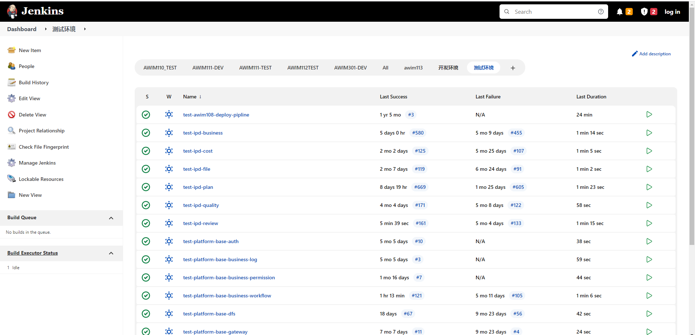
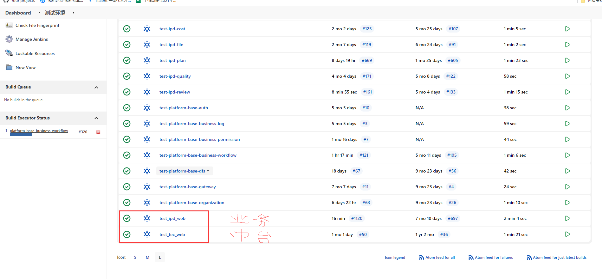

1. 业务平台
   1. http://192.168.80.35:8889/#/plan/project
   2. lilei andawell
2. 一体化
   1. http://192.168.80.35:8888/#/process/create
   2. lilei andawell
3. 海洋电脑
   1. andawell
   2. 123 a123
4. 禅道
   1. wangwentao
   2. Zx123456
5. 企业云盘
   1. wangwt1
   2. zx123456
6. 合并代码
   1. 正常流程是在dev切分支，然后提交合并到dev请求给海洋，海洋合并到test分支给测试，通过的话就合并到master
   2. 如果需要改部署的线上bug，首先在master相应的tag版本号切一个分支，在这里改，然后提交合并请求到test或者master，如果test有问题就只能master
   3. 如果上面两种情况同时存在，先从master相应的tag切一个分支，改完bug后，在jeklins上面修改部署的分支，测试进行测试，然后合并到master分支
      1. master分支再合并到test、dev分支，这时master、test、dev分支已经全都更新完成修改的线上bug
      2. 此时我们自己切出去的dev-pro分支正在添加新的功能，这时直接从dev分支merge request到当前dev-pro分支，解决冲突，完成新的功能
      3. 最后把开发dev-pro分支合并到dev，再合并到test，再合并到master分支
7. git
   1. wangwentao57@163.com
   2. zx123456
8. 服务
   1. 宋冠男：192.168.82.244
9. jenkins部署项目
   1. 
   1. 