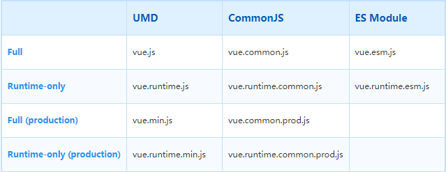

1. 启动项目报错
   1. `[!] (plugin Rollup Core) Error: Could not load `
   2. 原因：rollup-plugin-alias对windows的兼容不好
   3. 下载https://github.com/ideayuye/rollup-plugin-alias并覆盖掉本地文件夹 \node_modules\rollup-plugin-alias
   4. 进入rollup-plugin-alias文件夹，依次执行npm i ,npm run build
   5. 重新启动vue项目
2. 扫盲
   1. 执行 npm run build 命令之后会发现在 dist 目录下生成一堆特殊命名的 vue.*.js 文件，这些特殊的命名分别的意思
      1. 
   2. 名词解释
      1. Full：这是一个全量的包，包含编译器（compiler）和运行时（runtime）
      2. Compiler：编译器，负责将模版字符串（即你编写的类 html 语法的模版代码）编译为 JavaScript 语法的 render 函数
      3. Runtime：负责创建 Vue 实例、渲染函数、patch 虚拟 DOM 等代码，基本上除了编译器之外的代码都属于运行时代码
      4. UMD：兼容 CommonJS 和 AMD 规范，通过 CDN 引入的 vue.js 就是 UMD 规范的代码，包含编译器和运行时
      5. CommonJS：典型的应用比如 nodeJS，CommonsJS 规范的包是为了给 browserify 和 webpack 1 这样旧的打包器使用的。他们默认的入口文件为 vue.runtime.common.js
      6. ES Module：现代 JavaScript 规范，ES Module 规范的包是给像 webpack 2 和 rollup 这样的现代打包器使用的。这些打包器默认使用仅包含运行时的 vue.runtime.esm.js 文件
   3. 运行时（Runtime）+ 编译器（Compiler） vs. 只包含运行时（Runtime-only）
      1. 如果你需要动态编译模版（比如：将字符串模版传递给 template 选项，或者通过提供一个挂载元素的方式编写 html 模版），你将需要编译器，因此需要一个完整的构建包
      2. 当你使用 vue-loader 或者 vueify 时，*.vue 文件中的模版在构建时会被编译为 JavaScript 的渲染函数。因此你不需要包含编译器的全量包，只需使用只包含运行时的包即可
      3. 只包含运行时的包体积要比全量包的体积小 30%。因此尽量使用只包含运行时的包，如果你需要使用全量包，那么你需要进行如下配置
        
        ```webpack
        module.exports = {
          // ...
          resolve: {
            alias: {
              'vue$': 'vue/dist/vue.esm.js'
            }
          }
        }
        ```

        ```Rollup
        const alias = require('rollup-plugin-alias')
        rollup({
          // ...
          plugins: [
            alias({
              'vue': 'vue/dist/vue.esm.js'
            })
          ]
        })
        ```

        ```Browserify   Add to your project's package.json:
        {
          // ...
          "browser": {
            "vue": "vue/dist/vue.common.js"
          }
        }
        ```
3. 源码目录结构
   1. 