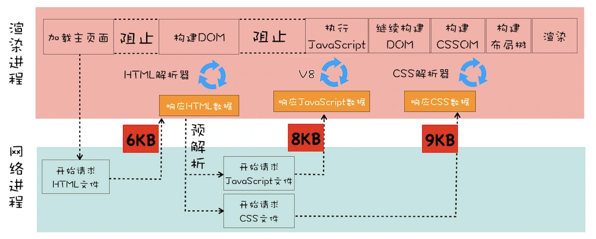
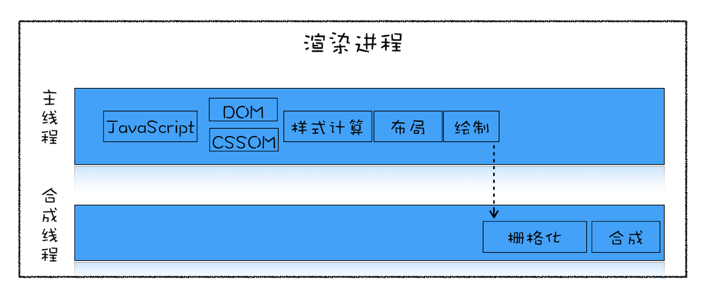

1. 使用 typeof 检测 Null 类型时，返回的是 Object。这是当初 JavaScript 语言的一个 Bug
   1. 一直保留至今，之所以一直没修改过来，主要是为了兼容老的代码
2. 所以要想缩短白屏时长，可以有以下策略：
   1. 通过内联 JavaScript、内联 CSS 来移除这两种类型的文件下载，这样获取到 HTML 文件之后就可以直接开始渲染流程了。
   2. 但并不是所有的场合都适合内联，那么还可以尽量减少文件大小，比如通过 webpack 等工具移除一些不必要的注释，并压缩 JavaScript 文件。
   3. 还可以将一些不需要在解析 HTML 阶段使用的 JavaScript 标记上 sync 或者 defer。
   4. 对于大的 CSS 文件，可以通过媒体查询属性，将其拆分为多个不同用途的 CSS 文件，这样只有在特定的场景下才会加载特定的 CSS 文件。
3. 这也是 CSS 动画比 JavaScript 动画高效的原因。  
   1. 这段代码就是提前告诉渲染引擎 box 元素将要做几何变换和透明度变换操作，这时候渲染引擎会将该元素单独实现一帧，等这些变换发生时，渲染引擎会通过合成线程直接去处理变换，这些变换并没有涉及到主线程，这样就大大提升了渲染的效率
   2. 因为JS执行动画会占用渲染主线程 而CSS操作动画 如果帧的生成方式是合成方式 那么直接在合成线程操作就行 不会引起渲染主线程阻塞
4. 性能优化
   1. 加载阶段：指从发出请求到渲染出完整页面的过程，影响到这个阶段的主要因素有网络和 JavaScript 脚本
      1. 
      2. JavaScript、首次请求的 HTML 资源文件、CSS 文件是会阻塞首次渲染的，因为在构建 DOM 的过程中需要 HTML 和 JavaScript 文件，在构造渲染树的过程中需要用到 CSS 文件
      3. 三个影响页面首次渲染的核心因素
         1. 关键资源个数
            1. 关键资源个数越多，首次页面的加载时间就会越长。比如上图中的关键资源个数就是 3 个，1 个 HTML 文件、1 个 JavaScript 和 1 个 CSS 文件
         2. 关键资源大小
            1. 通常情况下，所有关键资源的内容越小，其整个资源的下载时间也就越短，那么阻塞渲染的时间也就越短。
         3. 请求关键资源需要多少个 RTT（Round Trip Time）
            1. 当使用 TCP 协议传输一个文件时，比如这个文件大小是 0.1M，由于 TCP 的特性，这个数据并不是一次传输到服务端的，而是需要拆分成一个个数据包来回多次进行传输的
            2. RTT 就是这里的往返时延。它是网络中一个重要的性能指标，表示从发送端发送数据开始，到发送端收到来自接收端的确认，总共经历的时延
            3. 通常 1 个 HTTP 的数据包在 14KB 左右，所以 1 个 0.1M 的页面就需要拆分成 8 个包来传输了，也就是说需要 8 个 RTT
            4. HTML 资源，大小是 6KB，小于 14KB，所以 1 个 RTT 就可以解决了
            5. 至于 JavaScript 和 CSS 文件，这里需要注意一点，由于渲染引擎有一个预解析的线程，在接收到 HTML 数据之后，预解析线程会快速扫描 HTML 数据中的关键资源，一旦扫描到了，会立马发起请求，你可以认为 JavaScript 和 CSS 是同时发起请求的，所以它们的请求是重叠的，那么计算它们的 RTT 时，只需要计算体积最大的那个数据就可以了
            6. 这里最大的是 CSS 文件（9KB），所以我们就按照 9KB 来计算，同样由于 9KB 小于 14KB，所以 JavaScript 和 CSS 资源也就可以算成 1 个 RTT。也就是说，上图中关键资源请求共花费了 2 个 RTT
      4. 总的优化原则就是减少关键资源个数，降低关键资源大小，降低关键资源的 RTT 次数
         1. 减少关键资源的个数
            1. 如果 JavaScript 代码没有 DOM 或者 CSSOM 的操作，则可以改成 async 或者 defer 属性；同样对于 CSS，如果不是在构建页面之前加载的，则可以添加媒体取消阻止显现的标志
         2. 减少关键资源的大小
            1. 可以压缩 CSS 和 JavaScript 资源，移除 HTML、CSS、JavaScript 文件中一些注释内容
         3. 减少关键资源 RTT 的次数
            1. 可以通过减少关键资源的个数和减少关键资源的大小搭配来实现。除此之外，还可以使用 CDN 来减少每次 RTT 时长
   2. 交互阶段
      1. 
      2. 谈交互阶段的优化，其实就是在谈渲染进程渲染帧的速度，因为在交互阶段，帧的渲染速度决定了交互的流畅度
         1. 在交互阶段没有了加载关键资源和构建 DOM、CSSOM 流程，通常是由 JavaScript 触发交互动画的
         2. 大部分情况下，生成一个新的帧都是由 JavaScript 通过修改 DOM 或者 CSSOM 来触发的。还有另外一部分帧是由 CSS 来触发的。
         3. 如果在计算样式阶段发现有布局信息的修改，那么就会触发重排操作
         4. 如果在计算样式阶段没有发现有布局信息的修改，只是修改了颜色一类的信息，那么就不会涉及到布局相关的调整，所以可以跳过布局阶段，直接进入绘制阶段，这个过程叫重绘
         5. 还有另外一种情况，通过 CSS 实现一些变形、渐变、动画等特效，这是由 CSS 触发的，并且是在合成线程上执行的，这个过程称为合成。因为它不会触发重排或者重绘，而且合成操作本身的速度就非常快，所以执行合成是效率最高的方式
      3. 优化方案：一个大的原则就是让单个帧的生成速度变快
         1. 减少 JavaScript 脚本执行时间
            1. 有时 JavaScript 函数的一次执行时间可能有几百毫秒，这就严重霸占了主线程执行其他渲染任务的时间
            2. 一种是将一次执行的函数分解为多个任务，使得每次的执行时间不要过久
            3. 另一种是采用 Web Workers。你可以把 Web Workers 当作主线程之外的一个线程，在 Web Workers 中是可以执行 JavaScript 脚本的，不过 Web Workers 中没有 DOM、CSSOM 环境，这意味着在 Web Workers 中是无法通过 JavaScript 来访问 DOM 的，所以我们可以把一些和 DOM 操作无关且耗时的任务放到 Web Workers 中去执行
         2. 避免强制同步布局
            1. 通过 DOM 接口执行添加元素或者删除元素等操作后，是需要重新计算样式和布局的，不过正常情况下这些操作都是在另外的任务中异步完成的，这样做是为了避免当前的任务占用太长的主线程时间
            2. 执行 JavaScript 添加元素是在一个任务中执行的，重新计算样式布局是在另外一个任务中执行，这就是正常情况下的布局操作
            3. 所谓强制同步布局，是指 JavaScript 强制将计算样式和布局操作提前到当前的任务中
            4. 将新的元素添加到 DOM 之后，我们又调用了main_div.offsetHeight来获取新 main_div 的高度信息。如果要获取到 main_div 的高度，就需要重新布局，所以这里在获取到 main_div 的高度之前，JavaScript 还需要强制让渲染引擎默认执行一次布局操作。我们把这个操作称为强制同步布局
            5. 为了避免强制同步布局，我们可以调整策略，在修改 DOM 之前查询相关值
         3. 避免布局抖动
            1. 所谓布局抖动，是指在一次 JavaScript 执行过程中，多次执行强制布局和抖动操作
            2. 这种情况的避免方式和强制同步布局一样，都是尽量不要在修改 DOM 结构时再去查询一些相关值
         4. 合理利用 CSS 合成动画
            1. 合成动画是直接在合成线程上执行的，这和在主线程上执行的布局、绘制等操作不同，如果主线程被 JavaScript 或者一些布局任务占用，CSS 动画依然能继续执行。所以要尽量利用好 CSS 合成动画，如果能让 CSS 处理动画，就尽量交给 CSS 来操作
         5. 避免频繁的垃圾回收
            1. 如果在一些函数中频繁创建临时对象，那么垃圾回收器也会频繁地去执行垃圾回收策略。这样当垃圾回收操作发生时，就会占用主线程，从而影响到其他任务的执行，严重的话还会让用户产生掉帧、不流畅的感觉
5. 垃圾回收
   1. 调用栈中的数据是如何回收的
   2. 堆中的数据是如何回收的
      1. 在 V8 中会把堆分为新生代和老生代两个区域，新生代中存放的是生存时间短的对象，老生代中存放的生存时间久的对象
         1. 新生区通常只支持 1～8M 的容量，而老生区支持的容量就大很多了
         2. 副垃圾回收器，主要负责新生代的垃圾回收
            1. 新生代中用 Scavenge 算法来处理
            2. 对象区域、空闲区域
         3. 主垃圾回收器，主要负责老生代的垃圾回收
            1. 主垃圾回收器是采用标记 - 清除（Mark-Sweep）的算法进行垃圾回收的
      2. 垃圾回收器的工作流程
         1. 第一步是标记空间中活动对象和非活动对象。所谓活动对象就是还在使用的对象，非活动对象就是可以进行垃圾回收的对象
         2. 第二步是回收非活动对象所占据的内存。其实就是在所有的标记完成之后，统一清理内存中所有被标记为可回收的对象
         3. 第三步是做内存整理。一般来说，频繁回收对象后，内存中就会存在大量不连续空间，我们把这些不连续的内存空间称为内存碎片。当内存中出现了大量的内存碎片之后，如果需要分配较大连续内存的时候，就有可能出现内存不足的情况。所以最后一步需要整理这些内存碎片，但这步其实是可选的，因为有的垃圾回收器不会产生内存碎片，比如接下来我们要介绍的副垃圾回收器
   3. 全停顿
      1. 由于 JavaScript 是运行在主线程之上的，一旦执行垃圾回收算法，都需要将正在执行的 JavaScript 脚本暂停下来，待垃圾回收完毕后再恢复脚本执行。我们把这种行为叫做全停顿（Stop-The-World）
6. 跨站脚本攻击（XSS：Cross Site Scripting）
   1. XSS 攻击是指黑客往 HTML 文件中或者 DOM 中注入恶意脚本，从而在用户浏览页面时利用注入的恶意脚本对用户实施攻击的一种手段
   2. 如果页面被注入了恶意 JavaScript 脚本，恶意脚本都能做哪些事情
      1. 可以窃取 Cookie 信息。恶意 JavaScript 可以通过“document.cookie”获取 Cookie 信息
      2. 可以监听用户行为。恶意 JavaScript 可以使用“addEventListener”接口来监听键盘事件，比如可以获取用户输入的信用卡等信息
      3. 可以通过修改 DOM 伪造假的登录窗口，用来欺骗用户输入用户名和密码等信息
      4. 还可以在页面内生成浮窗广告，这些广告会严重地影响用户体验
   3. 恶意脚本是怎么注入的
      1. 存储型 XSS 攻击
         1. 首先黑客利用站点漏洞将一段恶意 JavaScript 代码提交到网站的数据库中
         2. 然后用户向网站请求包含了恶意 JavaScript 脚本的页面
         3. 当用户浏览该页面的时候，恶意脚本就会将用户的 Cookie 信息等数据上传到服务器
         4. 2015 年喜马拉雅就被曝出了存储型 XSS 漏洞。起因是在用户设置专辑名称时，服务器对关键字过滤不严格，比如可以将专辑名称设置为一段 JavaScript，当黑客将专辑名称设置为一段 JavaScript 代码并提交时，喜马拉雅的服务器会保存该段 JavaScript 代码到数据库中。然后当用户打开黑客设置的专辑时，这段代码就会在用户的页面里执行，这样就可以获取用户的 Cookie 等数据信息
      2. 反射型 XSS 攻击
         1. 恶意 JavaScript 脚本属于用户发送给网站请求中的一部分，随后网站又把恶意 JavaScript 脚本返回给用户
         2. 当恶意 JavaScript 脚本在用户页面中被执行时，黑客就可以利用该脚本做一些恶意操作。
         3. 在现实生活中，黑客经常会通过 QQ 群或者邮件等渠道诱导用户去点击这些恶意链接，所以对于一些链接我们一定要慎之又慎。
         4. 另外需要注意的是，Web 服务器不会存储反射型 XSS 攻击的恶意脚本，这是和存储型 XSS 攻击不同的地方
      3. 基于 DOM 的 XSS 攻击
         1. 具体来讲，黑客通过各种手段将恶意脚本注入用户的页面中，比如通过网络劫持在页面传输过程中修改 HTML 页面的内容，这种劫持类型很多，有通过 WiFi 路由器劫持的，有通过本地恶意软件来劫持的，它们的共同点是在 Web 资源传输过程或者在用户使用页面的过程中修改 Web 页面的数据
   4. 如何阻止 XSS 攻击
      1. 服务器对输入脚本进行过滤或转码
      2. 充分利用 CSP （内容安全策略）
         1. 限制加载其他域下的资源文件，这样即使黑客插入了一个 JavaScript 文件，这个 JavaScript 文件也是无法被加载的
         2. 禁止向第三方域提交数据，这样用户数据也不会外泄
         3. 禁止执行内联脚本和未授权的脚本
         4. 还提供了上报机制，这样可以帮助我们尽快发现有哪些 XSS 攻击，以便尽快修复问题
      3. 使用 HttpOnly 属性
         1. 由于很多 XSS 攻击都是来盗用 Cookie 的，因此还可以通过使用 HttpOnly 属性来保护我们 Cookie 的安全
         2. 通常服务器可以将某些 Cookie 设置为 HttpOnly 标志，HttpOnly 是服务器通过 HTTP 响应头来设置的
         3. set-cookie 属性值最后使用了 HttpOnly 来标记该 Cookie
         4. 使用 HttpOnly 标记的 Cookie 只能使用在 HTTP 请求过程中，所以无法通过 JavaScript 来读取这段 Cookie，无法通过 document.cookie 读取
7. 跨站请求伪造攻击（CSRF：Cross-site request forgery）
   1. 是指黑客引诱用户打开黑客的网站，在黑客的网站中，利用用户的登录状态发起的跨站请求。CSRF 攻击就是黑客利用了用户的登录状态，并通过第三方的站点来做一些坏事
   2. 通常当用户打开了黑客的页面后，黑客有三种方式去实施 CSRF 攻击
      1. 自动发起 Get 请求
         1. 黑客将转账的请求接口隐藏在 img 标签内，欺骗浏览器这是一张图片资源。
         2. 当该页面被加载时，浏览器会自动发起 img 的资源请求，如果服务器没有对该请求做判断的话，那么服务器就会认为该请求是一个转账请求，于是用户账户上的 100 极客币就被转移到黑客的账户上去了
      2. 自动发起 POST 请求
         1. 黑客在他的页面中构建了一个隐藏的表单，该表单的内容就是极客时间的转账接口。
         2. 当用户打开该站点之后，这个表单会被自动执行提交；当表单被提交之后，服务器就会执行转账操作
      3. 引诱用户点击链接
         1. a href="https://"> 点击下载美女照片 a
         2. 这段黑客站点代码，页面上放了一张美女图片，下面放了图片下载地址，而这个下载地址实际上是黑客用来转账的接口，一旦用户点击了这个链接，那么他的极客币就被转到黑客账户上了。
   3. 如何防止 CSRF 攻击
      1. 充分利用好 Cookie 的 SameSite 属性
         1. 通常 CSRF 攻击都是从第三方站点发起的，要防止 CSRF 攻击，我们最好能实现从第三方站点发送请求时禁止 Cookie 的发送，因此在浏览器通过不同来源发送 HTTP 请求时，有如下区别：
            1. 如果是从第三方站点发起的请求，那么需要浏览器禁止发送某些关键 Cookie 数据到服务器
            2. 如果是同一个站点发起的请求，那么就需要保证 Cookie 数据正常发送
         2. 在 HTTP 响应头中，通过 set-cookie 字段设置 Cookie 时，可以带上 SameSite 选项
         3. SameSite 选项通常有 Strict、Lax 和 None 三个值
            1. Strict 最为严格。如果 SameSite 的值是 Strict，那么浏览器会完全禁止第三方 Cookie
            2. Lax 相对宽松一点。在跨站点的情况下，从第三方站点的链接打开和从第三方站点提交 Get 方式的表单这两种方式都会携带 Cookie。但如果在第三方站点中使用 Post 方法，或者通过 img、iframe 等标签加载的 URL，这些场景都不会携带 Cookie
            3. 而如果使用 None 的话，在任何情况下都会发送 Cookie 数据
      2. 验证请求的来源站点
         1. 在服务器端验证请求来源的站点。由于 CSRF 攻击大多来自于第三方站点，因此服务器可以禁止来自第三方站点的请求。那么该怎么判断请求是否来自第三方站点呢？
         2. Referer 是 HTTP 请求头中的一个字段，记录了该 HTTP 请求的来源地址
         3. 但在服务器端验证请求头中的 Referer 并不是太可靠，因此标准委员会又制定了 Origin 属性，在一些重要的场合，比如通过 XMLHttpRequest、Fecth 发起跨站请求或者通过 Post 方法发送请求时，都会带上 Origin 属性
         4. Origin 属性只包含了域名信息，并没有包含具体的 URL 路径，这是 Origin 和 Referer 的一个主要区别
         5. 因此，服务器的策略是优先判断 Origin，如果请求头中没有包含 Origin 属性，再根据实际情况判断是否使用 Referer 值
      3. CSRF Token
         1. 第一步，在浏览器向服务器发起请求时，服务器生成一个 CSRF Token
            1. CSRF Token 其实就是服务器生成的字符串，然后将该字符串植入到返回的页面中
         2. 第二步，在浏览器端如果要发起转账的请求，那么需要带上页面中的 CSRF Token，然后服务器会验证该 Token 是否合法
            1. 如果是从第三方站点发出的请求，那么将无法获取到 CSRF Token 的值，所以即使发出了请求，服务器也会因为 CSRF Token 不正确而拒绝请求
8. HTTPS：让数据传输更安全
   1. 从 HTTP 协议栈层面来看，我们可以在 TCP 和 HTTP 之间插入一个安全层（SSL/TLS），所有经过安全层的数据都会被加密或者解密
      1. HTTPS 并非是一个新的协议，通常 HTTP 直接和 TCP 通信，HTTPS 则先和安全层通信，然后安全层再和 TCP 层通信。也就是说 HTTPS 所有的安全核心都在安全层，它不会影响到上面的 HTTP 协议，也不会影响到下面的 TCP/IP
      2. 安全层有两个主要的职责：对发起 HTTP 请求的数据进行加密操作和对接收到 HTTP 的内容进行解密操作
   2. 通过引入数字证书CA，我们就实现了服务器的身份认证功能，这样即便黑客伪造了服务器，但是由于证书是没有办法伪造的，所以依然无法欺骗用户
9.  服务端渲染原理：SSR
   1. 页面的渲染流程也全部都是浏览器加载完 JavaScript 文件后，由 JavaScript 获取当前的路由地址，再决定渲染哪个页面。
      1. 这种架构下，所有的路由和页面都是在客户端进行解析和渲染的，我们称之为 Client Side Rendering，简写为 CSR，也就是客户端渲染
   2. 两个小问题
      1. 项目部署上线之后的入口文件是dist 文件夹其中的 index.html 文件
      2. 用户访问这个页面后，页面的首屏需要等待 JavaScript 加载和执行完毕才能看到，这样白屏时间肯定比 body 内部写页面标签的要长一些
      3. 其次，搜索引擎的爬虫抓取到你的页面数据后，发现 body 是空的，也会认为你这个页面是空的，这对于 SEO 是很不利的
      4. 我们就需要在用户访问页面的时候，能够把首屏渲染的 HTML 内容写入到 body 内部，也就是说我们需要在服务器端实现组件的渲染
10. ⽤户输⼊URL回⻋  
   1. 判断输⼊的是否为搜索内容还是请求的URL
      1. 如果是搜索内容，地址栏会使⽤浏览器默认的搜索引擎来合成带关键字的URL
      2. 如果是符合URL规则的内容，地址栏会根据规则，加上协议合成完成的URL
   2. 在回⻋前，会执⾏当前⻚⾯beforeunload
      1. beforeunload允许在退出之前执⾏⼀些数据清理
      2. 可以询问⽤户是否要离开当前⻚⾯
      3. 可以让浏览器取消导航
   3. 同意跳转或未监听beforeunload事件
      1. 加载新的地址
      2. 标签页上的图标进入加载状态
      3. 等待⽂档提交阶段
11. 浏览器进程将该URL通过IPC转发给⽹络进程
   1. ⽹络进程先检查判断是否使⽤缓存
      1. Service Worker 、强缓存/协商缓存、Push Cache推送缓存
      2. 浏览器在加载资源时
         1. 根据资源的⾸部判断是否命中强缓存 （Cache-Control/Expires）
            1. Cache-Control
               1. 优先级⼤于Expires
               2. max-age 资源有效时间（秒）
               3. no-cache 协商缓存
               4. no-store 禁⽌缓存
               5. public 所有⽤户都可缓存
               6. private 终端浏览器缓存
            2. Expires
               1. 值是⼀个绝对时间，表示资源的失效时间
               2. 缺点 服务器与客户端时间偏差较⼤导致缓存混乱
            3. 如果命中，浏览器直接从缓存中读取资源
            4. 没有命中，浏览器会发送请求到服务器
         2. 当Cache-Control=no-cache时，服务器通过⾸部判断是否命中协商缓存（Last-Modified/If-Modified-Since 与 ETag/If-None-Match）
            1. Last-Modified/If-Modified-Since
               1. Last-Modified表示该资源最后修改的时间
               2. 再次请求资源时，请求头中会包含If-Modified-Since，该值为缓存之前返回的Last-Modified
               3. 服务器在接收到后也会做比对，如果相同则命中协商缓存
               4. 如果命中，服务器返回304并不反回资源也不反回Last-Modified。继续使⽤缓存
               5. 没有命中，重新发起请求
               6. 缺点 短时间内资源发⽣了改变，Last-Modified并不会发⽣变化
            2. ETag/If-None-Match
               1. ETag资源的唯⼀标识，资源改变时ETag会发⽣变化
               2. 再次请求资源时，请求头中会包含ETag/If-None-Match，该值为缓存之前返回的ETag
               3. 服务器判断是否命中协商缓存
               4. 如果命中，服务器返回304并不反回资源，但会将ETag返回。继续使⽤缓存
               5. 没有命中，重新发起请求
         3. 当Cache-Control=no-store时 禁⽌使⽤缓存
   2. ⽹络进程发起真正的URL请求
      1. 如果是HTTPS协议 需要建⽴TLS连接
      2. 进⾏DNS解析以获取服务器IP地址
         1. ⾸先搜索浏览器的DNS缓存，缓存中维护⼀张域名与IP地址的表
         2. 没有命中，在操作系统中hosts⽂件搜索
         3. 没有命中，则将域名发送⾄本地域名服务器，本地域名服务器将通过递归查询⾃⼰的DNS缓存
         4. 没有命中，则本地域名服务器向上级域名服务器进⾏迭代查询
            1. 本地域名服务器向根域名服务器发起请求，根域名服务器返回顶级域名服务器的地址给本地域名服务器
            2. 本地域名服务器拿到这个顶级域名服务器的地址后，向其发起请求，获取权限域名服务器的地址
            3. 本地域名服务器根据权限域名服务器的地址，向其发起请求，最终得到对应的IP地址
         5. 本地域名服务器得到IP地址返回给操作系统，同时将IP缓存起来
         6. 操作系统将IP返回给浏览器，也将IP缓存起来
         7. 浏览器得到了对应IP地址，也将IP缓存起来
   3. 建⽴TCP连接 三次握⼿
      1. 客户端⾸先发送⼀个带SYN标志的数据包给对⽅（序号为J），并进入SYN_SEND状态
      2. 服务器接收到数据包SYN　J后，会确认该数据包已经收到并回传⼀个带有ACK　J＋１标志位和SYN　Ｋ的数据包，服务器进入SYN_RECV状态
      3. 最后，客户端进入链接状态后，向服务器回传⼀个带有ACK　K＋１标志的数据包确认客户端已收到建立确认链接，服务器收到ACK标志位后，服务端进入链接已建立状态
   4. 发起请求
      1. 构建请求 请求⾏、请求头、相关的Cookie附加到请求头中
      2. 向服务器发送请求
12. ⽹络进程接收到响应头数据，解析数据转发给浏览器进程
   1. 服务器接收到请求后，⽣成响应数据（响应⾏、响应头、响应体）
   2. 并发给⽹络进程
13. 浏览器进程接收到响应头数据后，发送提交导航消息到渲染进程
   1. 如果Connection是keep-alive服务器保持TCP连接
   2. 如果没有或是Close则关闭TCP连接 四次挥⼿　　　客户端或者服务端都能主动发起关闭链接请求
      1. 第⼀次挥⼿ 客户端发送⼀个**FIN报⽂**（连续释放报⽂段），报⽂中指定⼀个序列号。此时客户端处于FIN_WAIT1状态
      2. 第⼆次挥⼿ 服务端接收到**FIN之后，会发送ACK**报⽂（确认报⽂段），且将客户端的序列号+1作为ACK报⽂的序列号值，表明已经收到客户端的报⽂了，此时服务端处于CLOSE_WAIT状态。此时服务端不能马上关闭链接，需要检查是否还有未处理完成的数据
      3. 第三次挥⼿ 如果服务端处理完成所有数据，和客户端第⼀次挥⼿⼀样发送**FIN**报⽂(连续释放报⽂段)，且指定⼀个序列号。此时服务端处于LAST_ACK状态
      4. 第四次挥⼿ 客户端接收到**FIN报⽂，⼀样发送⼀个ACK**报⽂作为应答，且把服务端的序列号+1作为⾃⼰的ACK报⽂的序列号值，此时客户端处于TIME_WAIT状态。过⼀段时间（2MSL），确保服务端收到⾃⼰的ACK报⽂后进⼊CLOSED状态。服务端接收到ACK报⽂后就处于CLOSED状态了。
   3. 如果状态码是301、302，读取响应头中的Location字段重新定向地址，重新发起请求。
   4. 如果是200，可以继续处理该请求
   5. 响应头的 Content-Type的值，根据不同的资源类型采⽤不同的解析⽅式
      1. text/html 告诉浏览器是HTML格式
      2. application/octet-stream 告诉浏览器是字节流类型，通常按照下载类型处理该请求
      3. 如果是下载类型application/octet-stream，该请求会被提交给下载管理器，URL请求的导航流程到此结束
      4. 如果是HTML则会继续进⾏导航流程
      5. Chrome的默认策略：⼀个标签对应⼀个渲染进程，如果从一个页面打开了另一个新页面，而新页面和当前页面属于同一站点的话，那么新页面会复用父页面的渲染进程
14. 渲染进程接收到提交导航消息后，便准备接收HTML等类型数据，接收数据的⽅式时直接和⽹络进程建⽴数据通道
15. 等文档数据传输完成之后渲染进程会向浏览器进程确认提交，告诉浏览器进程已经准备好接收和解析⻚⾯数据
16. 浏览器进程接收到渲染进程的消息后，会更新浏览器界面状态，包括了安全状态、地址栏的 URL、前进后退的历史状态，并更新 Web 页面
17. 渲染阶段：一旦文档被提交，渲染进程便开始页面解析和子资源加载了
    1. 渲染进程将 HTML 内容转换为能够读懂的 DOM 树结构
    2. 样式计算：解析 CSS ，如果是style标签则开始解析CSS，如果是link标签则优先异步下载后解析CSS，⽣成CSS 规则树
    3. 遇到script标签，⾏内直接执⾏，如果是src引⼊则同步下载脚本⽂件，⽴即执⾏
      1. 普通script标签
         1. 如果携带 async 属性，异步加载，打断⻚⾯解析，同步执⾏
         2. 如果携带 defer，异步加载，等⻚⾯解析完成后，同步执⾏
         3. async优先级⼤于defer
      2. es6 type=module标签
         1. 异步加载，等⻚⾯解析完成后，同步执⾏ 等同于defer
         2. 如果携带async属性，异步加载及所有依赖项 打断⻚⾯解析 同步执⾏
    4. 合并 DOM 树和 CSS 规则树，⽣成 render 树（ Layout / reflow ），并计算元素的布局信息
    5. 对布局树进行分层，并生成分层树。
      1. 渲染引擎还需要为特定的节点生成专用的图层，并生成一棵对应的图层树
    6. 为每个图层生成绘制列表，并将其提交到合成线程
      1. 绘制 render 树（paint），在完成图层树的构建之后，渲染引擎会对图层树中的每个图层进行绘制，绘制⻚⾯像素信息。
      2. 把一个图层的绘制拆分成很多小的绘制指令，然后再把这些指令按照顺序组成一个待绘制列表
    7. 渲染引擎中的合成线程将图层分成图块，并在光栅化线程池中将图块转换成位图
      1. 合成线程会按照视口附近的图块来优先生成位图，实际生成位图的操作是由栅格化来执行的。所谓栅格化，是指将图块转换为位图
      2. 通常，栅格化过程都会使用 GPU 来加速生成，GPU 操作是运行在 GPU 进程中，如果栅格化操作使用了 GPU，那么最终生成位图的操作是在 GPU 中完成的，这就涉及到了跨进程操作
    8. 渲染引擎中的合成线程就会生成一个绘制图块的命令——“DrawQuad”提交给浏览器进程
    9. 浏览器进程根据 DrawQuad 消息生成页面绘制到内存中，并显示到显示器上
18. 相关概念
    1. 更新了元素的几何属性（重排）
       1. 从上图可以看出，如果你通过 JavaScript 或者 CSS 修改元素的几何位置属性，例如改变元素的宽度、高度等，那么浏览器会触发重新布局，解析之后的一系列子阶段，这个过程就叫重排
       2. 重排需要更新完整的渲染流水线，所以开销也是最大的
    2. 更新元素的绘制属性（重绘）
       1. 如果修改了元素的背景颜色，那么布局阶段将不会被执行，因为并没有引起几何位置的变换，所以就直接进入了绘制阶段，然后执行之后的一系列子阶段，这个过程就叫重绘
       2. 相较于重排操作，重绘省去了布局和分层阶段，所以执行效率会比重排操作要高一些。
    3. 直接合成阶段
       1. 那如果你更改一个既不要布局也不要绘制的属性，会发生什么变化呢？渲染引擎将跳过布局和绘制，只执行后续的合成操作，我们把这个过程叫做合成
       2. 我们使用了 CSS 的 transform 来实现动画效果，这可以避开重排和重绘阶段，直接在非主线程上执行合成动画操作。
       3. 这样的效率是最高的，因为是在非主线程上合成，并没有占用主线程的资源，另外也避开了布局和绘制两个子阶段，所以相对于重绘和重排，合成能大大提升绘制效率。